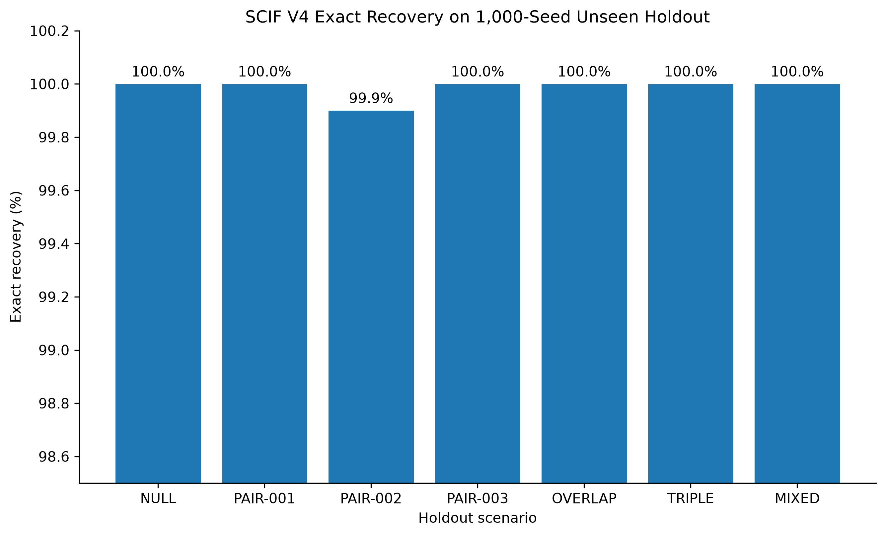
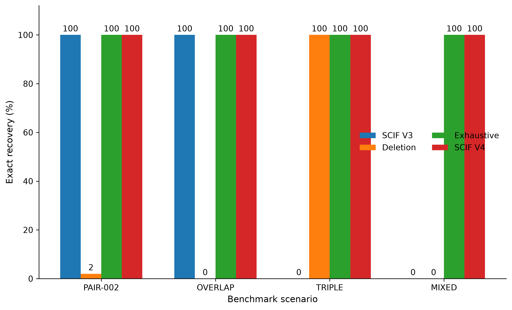
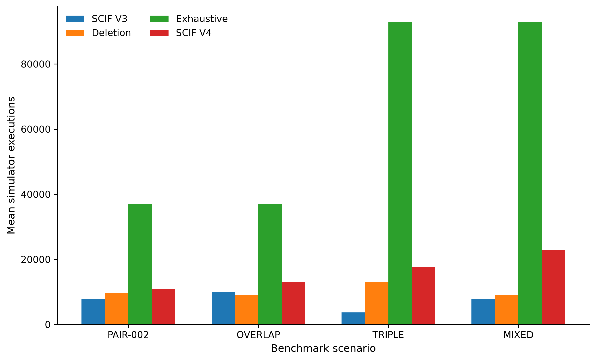
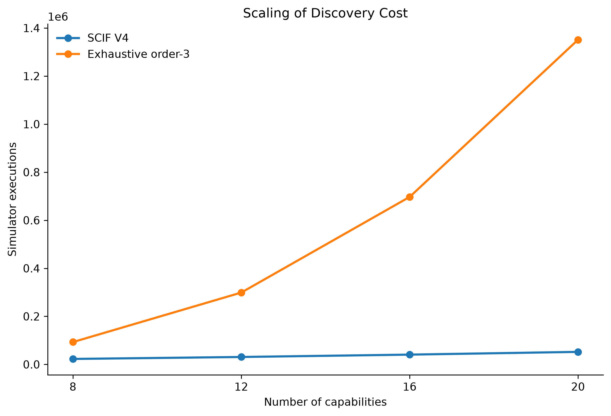
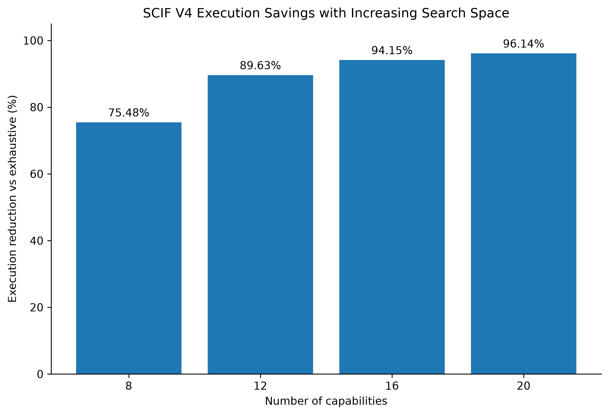

# Residual-Risk-Guided Discovery of Stochastic Mixed-Order Capability Interactions

**Berliant Research Prototype — SCIF v0.0.4**

---

# Abstract

Modern AI systems combine capabilities such as tool use, structured output, streaming, reasoning, and multimodal processing. Failures may emerge only from particular capability combinations, creating stochastic interaction bugs that are difficult to isolate through independent testing. Exhaustive combinatorial discovery can identify such interactions but becomes increasingly expensive as capability count and interaction order grow.

We present SCIF v0.0.4, a residual-risk-guided method for stochastic mixed-order interaction discovery. SCIF first screens and confirms pairwise interactions, suppresses those already supported by the data, measures the remaining empirical failure risk, and invokes higher-order localization only when substantial unexplained risk remains.

Evaluation on the synthetic BSIB benchmark family produced 6,999 exact recoveries across 7,000 unseen holdout runs (99.9857%), with no observed false interaction candidates. In a 100-seed method comparison, SCIF v0.0.4 recovered all evaluated pairwise, overlapping, pure three-way, and mixed-order structures; SCIF V3 and deletion localization both achieved 0% exact recovery on the mixed scenario. For that eight-capability benchmark, SCIF required 22,800 mean simulator executions versus 93,000 for exhaustive order-three discovery, a 75.48% reduction.

Ablation experiments showed distinct roles for residual-risk detection and higher-order localization. Across scaling experiments from eight to twenty capabilities, SCIF achieved 20/20 observed exact recoveries at each size while execution reduction reached 96.14%. These results support residual-risk-guided escalation as a promising approach for stochastic interaction discovery, while external validation beyond synthetic benchmarks remains future work.

---

# Introduction

Modern AI systems increasingly expose multiple capabilities within a
single execution environment, including tool use, structured outputs,
streaming, multimodal processing, parallel tool invocation, reasoning,
strict schema enforcement, and explicit tool selection.

These capabilities are often evaluated individually. However, system
failures may emerge only when particular capabilities are activated
together. Recent tool-augmented language-model benchmarks have
demonstrated failures associated with unavailable tools, multi-tool
settings, and silent tool errors
[@trevino2025failtalms; @sun2024toolsfail]. Such studies motivate
closer analysis of capability-rich AI systems, although they do not
attempt the stochastic interaction-localization problem studied here.

In this work, capability-interaction failures refer to failures whose
risk is associated not with one capability in isolation but with a
specific combination of capabilities.

The discovery problem is difficult for two reasons.

First, failures are stochastic. Repeated execution of the same
configuration may produce both successful and failing outcomes.
Discovery therefore requires statistical evidence rather than a
single deterministic observation.

Second, the number of possible capability combinations grows
combinatorially. For \(n\) capabilities, exhaustive testing through
interaction order three requires

\[
1+n+\binom{n}{2}+\binom{n}{3}
\]

distinct configurations before repeated stochastic trials are taken
into account.

For eight capabilities this corresponds to 93 configurations. At
1,000 stochastic executions per configuration, exhaustive order-three
evaluation requires 93,000 executions. At twenty capabilities, the
same procedure requires 1,351 configurations, or 1,351,000 executions.

This creates a tension between discovery completeness and evaluation
cost.

Pairwise methods provide one way to reduce this cost. They can
efficiently identify interactions whose signal appears in
two-capability configurations. However, they cannot recover a pure
higher-order interaction when all lower-order subsets remain near
baseline.

A different strategy is deletion-based localization. Starting from a
high-risk configuration, capabilities are removed one at a time and
the resulting decrease in failure probability is used to infer which
capabilities are essential to the fault.

This approach can localize an isolated monotonic higher-order
interaction. However, it can become unreliable when multiple
interactions overlap or when lower- and higher-order interactions are
simultaneously active. In such cases, removing one capability may
disable one fault while another remains active, masking the evidence
required for localization.

This work studies whether these limitations can be addressed without
returning to exhaustive combinatorial search.

We introduce SCIF v0.0.4, an adaptive stochastic interaction discovery
pipeline that combines pairwise discovery with conditional
higher-order escalation.

The central idea is to distinguish **explained risk** from
**unexplained residual risk**.

SCIF first discovers pairwise interactions. It then constructs
configurations in which those known pairwise interactions are
suppressed. If the remaining configuration returns to baseline risk,
the algorithm terminates. If substantial risk remains, the unexplained
signal triggers higher-order localization inside the residual
configuration.

This produces the pipeline:

**pairwise discovery** $\rightarrow$ **known-pair suppression**
$\rightarrow$ **residual-risk detection**
$\rightarrow$ **conditional higher-order localization**.

The method is evaluated using the Benchmark for Stochastic Interaction
Bugs (BSIB), a synthetic benchmark family designed to provide hidden
ground-truth capability interactions while exposing only stochastic
execution outcomes to discovery algorithms.

The evaluation covers:

- null configurations with no hidden interaction;
- strong and weak pairwise interactions;
- overlapping pairwise interactions;
- a pure three-way interaction;
- a mixed pairwise plus three-way interaction;
- ablation of the residual-risk stages;
- parameter sensitivity; and
- scaling from eight to twenty capabilities.

Across a 7,000-run unseen holdout evaluation, SCIF v0.0.4 achieved
6,999 exact recoveries, corresponding to 99.9857% exact recovery, with
no observed false interaction candidates.

In the tested mixed-order benchmark, pairwise SCIF and deletion
localization both failed to recover the complete interaction set,
while SCIF v0.0.4 achieved 100% exact recovery in the 100-seed method
comparison.

Relative to exhaustive order-three discovery, SCIF v0.0.4 reduced
mean simulator executions by 75.48% in the eight-capability mixed
setting. In the scaling study, the reduction increased to 96.14% at
twenty capabilities while exact recovery remained 100% across the
twenty evaluated seeds.

Prior work already establishes combinatorial interaction testing,
minimal failure-causing schemas, adaptive interaction localization,
masking-aware multiple-fault methods, and probabilistic fault
localization [@kuhn2008beyond; @nie2011mfs; @zhang2011fic;
@yilmaz2014masking; @niu2020multiple; @nishiura2024frog].

SCIF is therefore not positioned as the first adaptive, higher-order,
masking-aware, or probabilistic localization method. The contribution
evaluated here is narrower: **residual stochastic risk is used as an
escalation signal**. Interactions already supported by the data are
suppressed, the remaining risk is estimated through repeated execution,
and higher-order localization is invoked only when substantial
unexplained risk remains.

The contributions of this work are:

1. the BSIB benchmark formulation for controlled stochastic
   capability-interaction evaluation;
2. the SCIF pipeline combining pairwise discovery, known-interaction
   suppression, residual-risk detection, and conditional higher-order
   localization;
3. unseen-holdout, baseline-comparison, ablation, and sensitivity
   evaluation of the frozen method; and
4. an initial scaling analysis of recovery and execution cost as
   capability count increases.

---

# Related Work

## Combinatorial Testing and Interaction Localization

Combinatorial testing (CT) targets faults caused by interactions among input parameters or configuration options. Rather than enumerating every system configuration, t-way testing covers combinations up to a selected interaction strength [@kuhn2008beyond; @nie2011survey]. Higher-strength testing can expose interactions beyond pairs, but its cost increases rapidly with both interaction strength and the number of parameters.

Beyond detecting failing configurations, prior work has addressed localization of the combinations responsible for failure. Nie and Leung formalized the Minimal Failure-Causing Schema (MFS) for identifying minimal parameter-value combinations associated with failures [@nie2011mfs]. Zhang and Zhang proposed Faulty Interaction Characterization (FIC), which adaptively generates additional tests from previous outcomes [@zhang2011fic]. Shakya et al. similarly combined test augmentation and classification to isolate failure-inducing combinations [@shakya2012isolating], while error-locating arrays provide another adaptive combinatorial perspective [@martinez2009ela].

These studies establish adaptive interaction localization as prior art. SCIF addresses a narrower setting in which repeated executions estimate stochastic failure risk and search order is increased only when lower-order discoveries leave substantial unexplained risk.

## Masking and Multiple Faults

Localization becomes harder when multiple interactions can affect the same configuration. Yilmaz et al. introduced a feedback-driven adaptive approach for reducing masking effects by identifying likely causes and generating tests intended to exercise combinations without them [@yilmaz2014masking].

Niu et al. showed that multiple faults can interfere with traditional MFS identification and developed an approach specifically for multiple-fault settings [@niu2020multiple]. They later proposed an interleaving framework in which test generation and failure-inducing interaction identification exchange feedback during testing [@niu2020interleaving]. Pending-schema theory further examines unresolved, overlapping, and high-degree interactions in large configuration spaces [@niu2022pending].

These works are particularly relevant to the OVERLAP and MIXED benchmarks used in this study. SCIF differs in how already-supported interactions are used: it constructs configurations that suppress those interactions, repeatedly measures the remaining empirical failure risk, and uses that residual signal as a gate for higher-order localization.

## Statistical and Probabilistic Localization

Probabilistic reasoning has also been applied to fault localization. The Probabilistic Failure-Causing Schema model represents probabilistic evidence for candidate schemas [@wang2019pfs]. BayesFLo uses Bayesian reasoning to rank suspicious input combinations [@ji2023bayesflo], while FROG uses logistic-regression coefficients to estimate suspiciousness and reduce the search space for larger failure-inducing combinations [@nishiura2024frog].

SCIF therefore does not claim novelty from using probability alone. Its use of stochastic evidence is procedural: repeated executions estimate configuration-specific failure rates, these estimates support interaction confirmation through excess risk over lower-order subsets, and residual failure probability determines whether higher-order search is invoked.

## Minimality, Deletion, and Hitting Sets

SCIF is also related to failure-minimization techniques. Delta Debugging iteratively simplifies failing inputs to isolate minimal failure-inducing conditions [@zeller2002delta]. SCIF's higher-order localization similarly evaluates removals, but direct deletion can be misleading when several interactions are simultaneously active. SCIF therefore applies removal-based localization after suppressing interactions already supported by the data.

Recent work is especially relevant here. NoPend addresses complete, sound, and scalable MFS identification and uses minimal hitting-set generation in its pending-space reasoning [@xie2026nopend]. Minimal hitting sets are thus not themselves a contribution of SCIF. In SCIF, their role is specifically to construct configurations that disable all currently known pairwise interactions so that repeated executions can estimate how much stochastic risk remains unexplained.

## Reliability of Tool-Augmented AI Systems

BSIB's capability-oriented formulation is motivated by increasingly tool-enabled AI systems. FAIL-TaLMs evaluates failures involving under-specified queries and unavailable tools in single- and multi-tool settings [@trevino2025failtalms]. Other work shows that language models may also fail to recognize silent errors produced by faulty tools [@sun2024toolsfail].

Such benchmarks establish the importance of reliability evaluation for capability-rich AI systems, but their primary objective is to characterize tool-use failures rather than localize minimal stochastic interactions among system capabilities. BSIB instead provides controlled hidden interaction structures, enabling SCIF to be evaluated against known ground truth.

## Positioning of SCIF

Prior research therefore already establishes t-way combinatorial testing, MFS localization, adaptive test generation, masking-aware and multiple-fault methods, probabilistic fault localization, failure minimization, and hitting-set-based reasoning.

Accordingly, SCIF v0.0.4 is not positioned as the first adaptive, probabilistic, higher-order, masking-aware, or hitting-set-based interaction-localization method.

The design evaluated here is a **residual-risk-guided stochastic discovery pipeline**. It first screens and confirms lower-order interactions, constructs configurations that suppress interactions already supported by the data, repeatedly estimates the remaining failure risk, and invokes higher-order localization only when that residual evidence justifies escalation.

The experimental question is therefore whether this residual-risk-guided escalation can maintain accurate mixed-order interaction discovery while reducing simulator executions relative to exhaustive higher-order enumeration.

---

# Research Questions

This study evaluates whether residual-risk-guided escalation can recover stochastic mixed-order capability interactions accurately while reducing the cost of exhaustive higher-order discovery.

## RQ1 — Discovery Accuracy

**How accurately does SCIF v0.0.4 recover hidden interaction structures under stochastic outcomes?**

We evaluate exact recovery, missed interactions, and observed false interaction candidates across the unseen BSIB holdout.

## RQ2 — Efficiency Relative to Baselines

**How does SCIF v0.0.4 compare with pairwise discovery, deletion localization, and exhaustive discovery?**

We compare both exact interaction recovery and simulator execution cost on representative pairwise, overlapping, pure three-way, and mixed-order scenarios.

## RQ3 — Contribution of Residual-Risk Reasoning

**Do residual-risk detection and higher-order localization provide distinct benefits?**

Ablation experiments compare pairwise discovery alone, pairwise discovery with residual-risk detection, and the full SCIF v0.0.4 pipeline.

## RQ4 — Parameter Sensitivity

**How sensitive is recovery to key sampling and localization thresholds?**

We vary initial sampling, residual-risk, and removal thresholds while monitoring recovery and false interaction candidates.

## RQ5 — Scaling Behavior

**How does SCIF behave as capability count increases?**

We measure exact recovery, simulator executions, reduction relative to exhaustive order-three discovery, and wall-clock behavior from 8 to 20 capabilities.

---

# Methodology

## Problem Formulation

Let

\[
K = \{k_1, k_2, \ldots, k_n\}
\]

denote the set of capabilities available to a system.

A capability configuration is a subset

\[
C \subseteq K.
\]

Executing configuration \(C\) produces a stochastic binary outcome

\[
Y(C) \in \{0,1\},
\]

where \(Y(C)=1\) denotes a failure.

Each configuration therefore has an unknown failure probability

\[
p(C)=P(Y(C)=1).
\]

The discovery problem is to identify minimal subsets of capabilities
whose joint activation causes a substantial increase in failure risk,
while minimizing the total number of stochastic executions required.

## Stochastic Capability Interactions

A capability interaction is not defined only by a high absolute
failure probability.

A candidate set must also exhibit risk beyond that observed in its
relevant lower-order subsets.

For a candidate interaction \(C\), SCIF uses a joint-risk increment
concept of the form

\[
JRI(C)
=
\hat{p}(C)
-
\max_{S \subsetneq C}
\hat{p}(S),
\]

where \(\hat{p}\) denotes an empirical failure-rate estimate and
the maximum is taken over proper lower-order subsets of \(C\). For a
pair, these comparison configurations are the baseline and the two
singleton capabilities.

A candidate is therefore supported when its joint failure rate is
sufficiently large and its observed risk cannot be explained by a
lower-order subset.

## BSIB Benchmark Model

The Benchmark for Stochastic Interaction Bugs (BSIB) provides
synthetic capability configurations with hidden interaction faults.

The simulator exposes only stochastic execution outcomes to the
discovery algorithm.

The underlying true failure probability is not included in the
execution result.

This prevents the discovery algorithm from directly accessing the
benchmark ground truth.

## Keyed Stochastic Simulation

Experiments use deterministic keyed random streams.

For a fixed benchmark configuration and experiment seed, the random
outcome stream is stable even when configurations are evaluated in a
different order.

This design prevents algorithmic execution order from unintentionally
changing the stochastic evidence observed for the same configuration.

The keyed simulator therefore supports reproducible and fair
comparisons among discovery methods.

## Pairwise Discovery

SCIF v0.0.4 begins with the SCIF v0.0.3 pairwise discovery procedure.

The frozen evaluation configuration uses:

- 100 initial screening trials;
- 300 screening-retest trials;
- 1,500 confirmation trials;
- 1,000 subset-confirmation trials;
- minimum joint failure rate of 0.15;
- minimum joint-risk increment of 0.10;
- screening posterior-probability threshold of 0.20; and
- confirmation posterior-support threshold of 0.95.

Initial screening uses relaxed empirical thresholds equal to 75% of
the minimum joint-failure threshold and 67% of the minimum
joint-risk-increment threshold. With the frozen parameters, these are
0.1125 and 0.067, respectively.

A pair that immediately satisfies both screening thresholds proceeds
to confirmation. If its joint rate reaches the screening threshold
but its empirical JRI does not, SCIF estimates the posterior
probability that both screening conditions hold. A probability of at
least 0.20 triggers extension of the baseline, both singleton
configurations, and the pair to 300 trials before screening is
re-evaluated.

During confirmation, the baseline and singleton subsets are extended
to 1,000 trials and the candidate pair to 1,500 trials. Posterior
support is estimated from 10,000 Beta posterior samples using
Beta(f+0.5, n-f+0.5) for a configuration with f failures in n trials.
The reported confidence is the fraction of posterior samples for which
both the joint failure rate is at least 0.15 and the JRI is at least
0.10. A pair is confirmed only when its empirical thresholds are also
satisfied and this posterior support is at least 0.95.

## Limitation of Pairwise-Only Discovery

A pure higher-order interaction can remain invisible to every
lower-order subset.

For example, consider a three-way interaction involving capabilities

\[
\{a,b,c\}.
\]

It is possible for

\[
p(\{a,b\}),
p(\{a,c\}),
p(\{b,c\})
\]

to remain near baseline while

\[
p(\{a,b,c\})
\]

is substantially elevated.

A pairwise-only algorithm therefore cannot represent or recover this
type of fault.

This limitation motivates the higher-order stages of SCIF v0.0.4.

## Known-Pair Suppression

After pairwise discovery, SCIF v0.0.4 constructs probe configurations
intended to disable already-discovered pairwise interactions.

For the set of discovered pairwise interactions, the algorithm
computes minimal capability-removal sets that intersect every known
pair.

Removing such a set creates a configuration in which the discovered
pairwise interactions are suppressed.

Multiple minimal removal sets may exist.

SCIF evaluates the resulting residual configurations rather than
assuming that one particular suppression is sufficient.

## Residual-Risk Detection

Let \(C_r\) denote a configuration after suppression of known pairwise
interactions.

SCIF estimates

\[
\hat{p}(C_r)
\]

and compares the remaining failure signal with the estimated baseline.

Higher-order escalation is triggered only when residual failure risk
remains sufficiently large.

The frozen parameters are:

- 1,000 residual trials;
- minimum residual failure rate of 0.15; and
- minimum residual-risk increment of 0.10.

Conceptually, the residual stage asks:

> After explaining and suppressing the interactions already found,
> does substantial unexplained risk remain?

If the answer is no, SCIF terminates without invoking higher-order
localization.

If the answer is yes, the residual configuration becomes the input to
the higher-order localizer.

## Residual Higher-Order Localization

Higher-order localization is applied only after residual-risk
detection has justified escalation.

For each capability in the selected residual configuration, SCIF
measures the failure rate after removing that capability.

Let \(C_r\) be the source configuration and let \(k \in C_r\).

The empirical removal drop is

\[
D(k)
=
\hat{p}(C_r)
-
\hat{p}(C_r \setminus \{k\}).
\]

Capabilities whose removal causes a sufficiently large decrease in
failure risk are treated as candidate members of the hidden
interaction.

The frozen localization configuration uses:

- 1,000 trials per configuration;
- minimum failure rate of 0.15;
- minimum removal drop of 0.10; and
- minimum higher-order candidate size of three.

## Minimality Confirmation

Removal evidence alone is not sufficient.

The resulting candidate is evaluated directly, and its immediate
subsets are also tested.

The purpose is to verify that the candidate itself retains elevated
failure risk while dropping one of its essential members removes the
interaction signal.

This step protects against reporting unnecessarily large interaction
sets.

## Complete SCIF v0.0.4 Pipeline

The final procedure is:

1. perform adaptive pairwise discovery;
2. record confirmed pairwise interactions;
3. construct minimal suppression sets for the known pairs;
4. evaluate residual-risk probes;
5. stop when no substantial residual risk remains;
6. otherwise select a residual configuration;
7. apply deletion-style higher-order localization;
8. confirm candidate minimality; and
9. return pairwise and higher-order discoveries in a unified report.

The higher-order stage is therefore conditional rather than mandatory.

This design preserves the efficiency of pairwise discovery on simple
scenarios while providing an escalation path for unexplained
higher-order risk.

---

# Experimental Setup

## Benchmark Scenarios

The primary evaluation uses seven BSIB scenarios.

### NULL

`BSIB-NULL-001` contains no hidden interaction.

It evaluates whether the method avoids reporting interactions when
all configurations remain near baseline stochastic risk.

### PAIR-001

`BSIB-PAIR-001` contains a strong pairwise interaction between:

- `tools`; and
- `structured_output`.

### PAIR-002

`BSIB-PAIR-002` contains a weaker pairwise interaction between:

- `tools`; and
- `streaming`.

This scenario is specifically useful for evaluating stochastic
screening stability.

### PAIR-003

`BSIB-PAIR-003` contains an interaction between:

- `parallel_tools`; and
- `strict_schema`.

It serves as an additional unseen pairwise scenario.

### OVERLAP

`BSIB-OVERLAP-001` contains two pairwise interactions that share one
capability:

- `tools + streaming`; and
- `streaming + strict_schema`.

The scenario tests whether the discovery procedure can recover more
than one overlapping pair.

### TRIPLE

`BSIB-TRIPLE-001` contains the pure higher-order interaction:

- `tools + streaming + strict_schema`.

Its proper pairs remain near baseline.

The scenario therefore provides no pairwise interaction signal for the
hidden triple.

### MIXED

`BSIB-MIXED-001` contains both:

- pair: `tools + streaming`; and
- triple: `reasoning + strict_schema + multimodal`.

The benchmark is designed to expose masking behavior that affects
single-interaction deletion localization.

## Evaluation Metrics

The principal metric is exact recovery.

A run is counted as exactly recovered only when the complete set of
reported interactions equals the benchmark ground truth.

Additional measures include:

- pairwise recovery;
- higher-order recovery;
- residual-risk classification;
- false-positive runs;
- mean simulator executions;
- median simulator executions;
- minimum and maximum executions;
- 95th-percentile execution count;
- reduction relative to exhaustive discovery; and
- wall-clock time in the scaling experiment.

## Unseen Holdout Evaluation

The primary holdout evaluation uses 1,000 unseen seeds per benchmark
scenario.

The holdout seed range is:

\[
31001,\ldots,32000.
\]

Seven scenarios are evaluated, producing a total of

\[
7 \times 1000 = 7000
\]

SCIF v0.0.4 holdout runs.

Parameters were not modified after observing the holdout results.

This is important because one rare weak-pair miss was retained and
analyzed rather than being used to retune the algorithm.

## Baseline Comparison

Four discovery methods are compared:

1. SCIF v0.0.3;
2. deletion-based localization;
3. exhaustive discovery; and
4. SCIF v0.0.4.

The comparison study uses 100 seeds from:

\[
41001,\ldots,41100.
\]

The selected scenarios are:

- PAIR-002;
- OVERLAP;
- TRIPLE; and
- MIXED.

For pairwise scenarios, exhaustive discovery evaluates configurations
through order two.

For scenarios containing a triple, exhaustive discovery evaluates
configurations through order three.

With eight capabilities this corresponds to:

\[
1 + 8 + \binom{8}{2}
=
37
\]

configurations for exhaustive order-two discovery, or 37,000
simulator executions at 1,000 trials per configuration.

For exhaustive order-three discovery:

\[
1 + 8 + \binom{8}{2} + \binom{8}{3}
=
93
\]

configurations are evaluated, corresponding to 93,000 simulator
executions.

For adaptive methods, execution cost is the actual number of simulator
invocations performed by the method, including screening, retesting,
confirmation, residual probing, and localization where applicable.
The exhaustive baselines instead use the fixed 1,000-trial budget for
every enumerated configuration.

## Ablation Study

The ablation study uses 100 seeds:

\[
51001,\ldots,51100.
\]

Five representative scenarios are evaluated:

- NULL;
- PAIR-002;
- OVERLAP;
- TRIPLE; and
- MIXED.

Three algorithmic stages are compared:

### Stage A — V3 Pairwise Only

Only confirmed pairwise discoveries are considered.

### Stage B — V3 + Residual Detection

Pairwise discovery is followed by residual-risk classification.

This stage determines whether higher-order escalation is needed but
does not yet localize a higher-order interaction.

### Stage C — Full V4

The complete pipeline includes residual higher-order localization.

The ablation records:

- stage success;
- false residual escalations;
- missed escalations;
- false higher-order candidates; and
- mean execution cost.

## Sensitivity Study

The sensitivity study uses 100 seeds:

\[
61001,\ldots,61100.
\]

Four scenarios are tested:

- NULL;
- PAIR-002;
- TRIPLE; and
- MIXED.

The frozen baseline configuration is:

- `initial_trials = 100`;
- `min_residual_increment = 0.10`; and
- `higher_order_min_removal_drop = 0.10`.

The evaluated alternatives are:

- initial trials = 50;
- initial trials = 200;
- residual increment = 0.05;
- residual increment = 0.15;
- removal drop = 0.05; and
- removal drop = 0.15.

The purpose is sensitivity characterization rather than post-holdout
parameter optimization.

## Scaling Study

Scaling is evaluated using benchmark variants with:

- 8 capabilities;
- 12 capabilities;
- 16 capabilities; and
- 20 capabilities.

Each benchmark retains:

- one pairwise interaction; and
- one three-way interaction.

Additional capabilities are non-interacting noise capabilities.

Twenty seeds are evaluated for each size:

\[
71001,\ldots,71020.
\]

For \(n\) capabilities, exhaustive order-three discovery evaluates

\[
1+n+\binom{n}{2}+\binom{n}{3}
\]

configurations.

At 1,000 trials per configuration, exhaustive execution counts are:

- 93,000 for 8 capabilities;
- 299,000 for 12 capabilities;
- 697,000 for 16 capabilities; and
- 1,351,000 for 20 capabilities.

## Reproducibility

The reproducibility package contains benchmark definitions, simulator
implementation, discovery algorithms, automated tests, experiment
scripts, aggregated result files, and publication figure-generation
scripts.

All Python development commands are executed through a locked `uv`
environment. Repository-identifying information is omitted during
anonymous review.

---

# Results

## RQ1 — Holdout Discovery Accuracy

*Figure 1. SCIF v0.0.4 exact recovery across the seven 1,000-seed unseen holdout scenarios.*

SCIF v0.0.4 achieved 99.9857% exact recovery across the unseen
1,000-seed holdout evaluation.

**Table 1. Holdout exact recovery and execution cost.**

| Scenario | Exact Recovery | False-Positive Runs | Mean Executions |
|---|---:|---:|---:|
| NULL | 1000/1000 (100.0%) | 0/1000 | 4,907.6 |
| PAIR-001 | 1000/1000 (100.0%) | 0/1000 | 10,800.0 |
| PAIR-002 | 999/1000 (99.9%) | 0/1000 | 10,946.2 |
| PAIR-003 | 1000/1000 (100.0%) | 0/1000 | 10,846.2 |
| OVERLAP | 1000/1000 (100.0%) | 0/1000 | 13,100.0 |
| TRIPLE | 1000/1000 (100.0%) | 0/1000 | 17,712.3 |
| MIXED | 1000/1000 (100.0%) | 0/1000 | 22,803.2 |

Across all seven scenarios, SCIF obtained

\[
6999 / 7000 = 99.9857\%
\]

exact recovery, with a 95% Wilson interval of approximately
99.9191%--99.9975%. For scenarios with 1000/1000 observed recovery,
the corresponding interval is approximately 99.6173%--100%;
observed perfect recovery is therefore not interpreted as zero
underlying failure probability.

No false interaction candidate was observed in the 7,000 holdout runs.

## Rare PAIR-002 Holdout Miss

The only exact-recovery miss occurred on `PAIR-002` at seed 31269.
During the initial 100-trial screen, both the target pair and baseline
produced 10 failures, yielding an observed joint-risk increment of
0.000. The weak pair was therefore not promoted.

The residual stage later observed a failure rate of 0.242 and detected
unexplained risk, but higher-order localization correctly declined to
report an unsupported interaction. The run was consequently a false
negative rather than a false-positive discovery. Parameters were not
changed after observing this holdout result.

## RQ2 — Comparison with Discovery Baselines

*Figure 2. Exact recovery of SCIF V3, deletion localization, exhaustive discovery, and SCIF V4.*

*Figure 3. Mean simulator executions required by each discovery method.*

The 100-seed comparison shows that the evaluated methods differ
substantially across interaction structures.

**Table 2. Method comparison over 100 seeds per scenario.**

| Scenario | Method | Recovery | Mean Executions |
|---|---|---:|---:|
| PAIR-002 | SCIF V3 | 100% | 7,900 |
| PAIR-002 | Deletion | 2% | 9,570 |
| PAIR-002 | Exhaustive | 100% | 37,000 |
| PAIR-002 | SCIF V4 | 100% | 10,900 |
| OVERLAP | SCIF V3 | 100% | 10,100 |
| OVERLAP | Deletion | 0% | 9,000 |
| OVERLAP | Exhaustive | 100% | 37,000 |
| OVERLAP | SCIF V4 | 100% | 13,100 |
| TRIPLE | SCIF V3 | 0% | 3,700 |
| TRIPLE | Deletion | 100% | 13,000 |
| TRIPLE | Exhaustive | 100% | 93,000 |
| TRIPLE | SCIF V4 | 100% | 17,700 |
| MIXED | SCIF V3 | 0% | 7,800 |
| MIXED | Deletion | 0% | 9,000 |
| MIXED | Exhaustive | 100% | 93,000 |
| MIXED | SCIF V4 | 100% | 22,800 |

V3 and V4 both recovered the tested pairwise and overlapping-pair
structures, although V4 incurred additional residual-verification
cost. V3 could not recover the pure triple because its proper pairwise
subsets remained near baseline. Deletion recovered the isolated
TRIPLE but failed on OVERLAP and MIXED.

Across the 100 comparison seeds for each representative scenario,
SCIF V4 achieved 100% exact recovery on all four scenarios. For TRIPLE,
it used 17,700 mean executions versus 93,000 for exhaustive order-three
discovery, a reduction of approximately 80.97%. For MIXED,
V4 used 22,800 executions versus 93,000, a reduction of 75.48%.

## RQ3 — Ablation of Residual-Risk Reasoning

The ablation isolates the roles of residual-risk detection and
higher-order localization.

**Table 3. Ablation of residual-risk detection and localization.**

| Scenario | V3 Pairwise Only | V3 + Residual | Full V4 |
|---|---:|---:|---:|
| NULL | 100% | 100% | 100% |
| PAIR-002 | 100% | 100% | 100% |
| OVERLAP | 100% | 100% | 100% |
| TRIPLE | 0% | 100% correct escalation | 100% exact recovery |
| MIXED | 0% | 100% correct escalation | 100% exact recovery |

Across 500 ablation runs, there were no false residual escalations,
missed residual escalations, or false higher-order candidates.
In these ablation runs, residual detection identified when current
discoveries left important risk unexplained, while localization
converted that evidence into an exact higher-order candidate.

Mean executions for TRIPLE were 3,700 for V3, 4,700 for V3 plus
residual detection, and 17,700 for full V4. For MIXED they were 7,800,
10,800, and 22,800, respectively. Higher-order localization thus adds
substantial cost only after escalation is triggered.

## RQ4 — Parameter Sensitivity

The frozen configuration achieved 100% exact recovery across all four
sensitivity scenarios. Changing the residual-risk increment from 0.10
to 0.05 or 0.15 did not reduce recovery, and increasing the
higher-order minimum removal drop from 0.10 to 0.15 also preserved
exact recovery.

The important degradation occurred when the removal threshold was
reduced to 0.05: TRIPLE recovery fell to 95/100 and MIXED to 96/100.
Non-essential capabilities sometimes exhibited stochastic removal
drops of approximately 0.05--0.075, entering oversized candidate sets
that were subsequently rejected by minimality checks. The permissive
threshold therefore increased false-negative localization rather than
false-positive reporting. The frozen value of 0.10 was retained.

## RQ5 — Scaling Behavior

*Figure 4. Simulator execution scaling from 8 to 20 capabilities.*

*Figure 5. Relative execution reduction of SCIF V4 compared with exhaustive order-three discovery.*

SCIF obtained 20/20 exact recoveries at every tested capability count.
Because only twenty seeds were used per size, the 95% Wilson interval
for 20/20 recovery is approximately 83.89%--100%; these results are
therefore initial stability evidence rather than precise recovery estimates.

**Table 4. Scaling of recovery and simulator execution cost.**

| Capabilities | Exact Recovery | Mean SCIF V4 Executions | Exhaustive Executions | Reduction |
|---:|---:|---:|---:|---:|
| 8 | 20/20 (100%) | 22,800 | 93,000 | 75.48% |
| 12 | 20/20 (100%) | 31,000 | 299,000 | 89.63% |
| 16 | 20/20 (100%) | 40,800 | 697,000 | 94.15% |
| 20 | 20/20 (100%) | 52,200 | 1,351,000 | 96.14% |

From 8 to 20 capabilities, exhaustive order-three cost grew from
93,000 to 1,351,000 executions, whereas SCIF increased from 22,800 to
52,200. The relative reduction consequently increased from 75.48% to
96.14%.

## Wall-Clock Scaling

Mean synthetic runtime increased from 0.2282 seconds at 8 capabilities
to 0.3179, 0.5400, and 2.6731 seconds at 12, 16, and 20 capabilities,
respectively. The sharper increase from 16 to 20 capabilities is
consistent with overhead from the current minimal hitting-set
enumeration. Thus, simulator-execution savings do not imply uniformly
low internal computational complexity.

---

# Discussion

## Main Interpretation

SCIF's main advantage is the separation of already-explained risk from
unexplained residual risk. Pairwise discovery handles interactions
visible at order two, while higher-order localization is invoked only
when risk remains after known pairwise interactions are suppressed.
This conditional escalation trades a modest verification overhead for
the ability to detect when pairwise reasoning is insufficient.

## Pairwise and Higher-Order Behavior

The comparison indicates that pairwise discovery remains effective when
the underlying structure is genuinely pairwise. On PAIR-002, V3
recovered all 100 comparison seeds using fewer executions than V4
because it terminates without residual verification.

The TRIPLE result exposes the corresponding representational limit:
its proper pairwise subsets remain near baseline, so pairwise ranking
alone cannot reveal the hidden three-way interaction. SCIF V4 instead
detects unexplained residual risk and escalates to higher-order
localization.

## Mixed-Order Masking

MIXED combines a readily discoverable pair with an independent triple.
Direct deletion can remain ambiguous because removing a capability from
one active interaction may leave another interaction active, preserving
a high failure probability and masking removal evidence.

SCIF first suppresses the known pair and then localizes within the
residual configuration. In the evaluated mixed benchmark, this
separation exposes the hidden triple and explains why V4 succeeds where
pairwise-only and direct-deletion approaches do not.

## Interpretation of the Ablation

The ablation supports distinct roles for the two added stages.
Residual-risk detection correctly determined whether important risk
remained unexplained in all tested TRIPLE and MIXED runs, but did not
itself identify the interaction. Higher-order localization then
converted that residual evidence into exact recovery. This separation
avoids invoking expensive localization when pairwise discoveries
already explain the observed risk.

## Weak-Pair Holdout Miss

The single holdout miss, PAIR-002 seed 31269, resulted from finite
stochastic sampling: the target pair and baseline both produced 10
failures in the initial 100 trials. Residual detection later identified
unexplained risk, while localization declined to report an unsupported
higher-order candidate. Thus, the miss remained a false negative rather
than creating a false positive, and no post-holdout tuning was applied.

## Sensitivity and Conservative Localization

The sensitivity study shows a noise-versus-recall trade-off in the
higher-order removal threshold. Values of 0.10 and 0.15 preserved exact
recovery, whereas 0.05 admitted stochastic removal drops from
irrelevant capabilities and reduced TRIPLE and MIXED recovery.
Minimality checks rejected the resulting oversized candidates rather
than turning them into false interaction reports.

## Efficiency and Implications

Within the tested range, SCIF achieved progressively larger reductions
in simulator executions relative to exhaustive order-three discovery,
reaching a 96.14% reduction at twenty capabilities. This execution advantage should be
distinguished from implementation complexity: wall-clock growth at the
largest tested size indicates minimal hitting-set enumeration as an
optimization target.

Overall, the experiments support residual-risk-guided escalation:
discover simpler interactions first, suppress what they explain, and
increase search order only when substantial unexplained risk remains.
The evidence is limited to the evaluated pairwise and three-way
synthetic structures; broader interaction orders and production
systems require separate validation.

---

# Limitations and Threats to Validity

## Synthetic and External Validity

BSIB provides controlled stochastic behavior and exact hidden ground
truth but cannot reproduce the full complexity of production AI
systems, including state dependence, non-stationarity, continuous
parameters, semantic failures, and environmental effects. The results
therefore characterize behavior only within the evaluated synthetic
setting; real-system validation remains necessary.

## Interaction Scope

The experiments cover pairwise and three-way interactions. They do not
establish performance for arbitrary interaction orders. The residual
localizer also returns at most one higher-order candidate from a
selected residual configuration, leaving multiple simultaneous or
overlapping higher-order interactions for future study.

## Hitting-Set Scalability

Known interactions are suppressed through minimal hitting sets.
Although practical at the evaluated sizes, wall-clock growth indicates
increasing enumeration overhead. Larger systems may require optimized
hitting-set algorithms or alternative formulations.

## Benchmark Fault Composition

BSIB uses the maximum active failure probability when multiple faults
are present. Real systems may exhibit additive, multiplicative,
conditional, or non-monotonic composition, so alternative composition
models require separate evaluation.

## Stochastic Sampling and Parameters

Finite stochastic samples can obscure weak interactions, as illustrated
by the PAIR-002 holdout miss. Increasing sampling may reduce such
false-negative risk at additional execution cost. Sensitivity analysis
also covered only a limited parameter range, so different effect sizes
or benchmark distributions may require different operating points.

## Scaling and Statistical Uncertainty

The holdout used 1,000 seeds per scenario, whereas scaling used only
twenty seeds per capability count. Scaling results therefore provide
stronger evidence about execution trends than precise recovery
probabilities; observed 20/20 recovery should not be interpreted as
zero underlying failure probability.

## Baselines and Construct Validity

The comparison includes SCIF V3, deletion localization, exhaustive
discovery, and SCIF V4, but not every method from the broader
fault-localization literature. Exact interaction recovery is
appropriate for BSIB's known ground truth, while production debugging
may also depend on severity, latency, reproducibility, and explanation
quality.

## Internal Validity

Keyed deterministic random streams reduce evaluation-order
confounding, and 34 automated tests cover the principal benchmark and
discovery components. Nevertheless, implementation errors remain a
possible threat to internal validity.

---

# Conclusion

This work introduced SCIF v0.0.4, a residual-risk-guided pipeline for
stochastic mixed-order capability-interaction discovery. SCIF combines
pairwise discovery, known-interaction suppression, residual-risk
detection, and conditional higher-order localization.

Across 7,000 unseen BSIB holdout runs, SCIF achieved 6,999 exact
recoveries with no observed false interaction candidates. The
representative comparison further showed exact recovery across tested
pairwise, overlapping, pure three-way, and mixed-order structures, while
ablation showed distinct roles for residual detection and higher-order
localization. In the tested scaling study, execution reduction relative
to exhaustive order-three discovery reached 96.14% at twenty
capabilities.

These results support residual-risk-guided escalation within the
evaluated synthetic setting: increase search order only when existing
discoveries fail to explain remaining risk. Broader interaction
structures, more scalable hitting-set computation, additional
baselines, and real-system validation remain future work.
